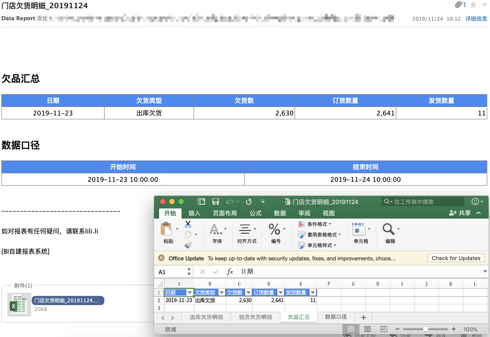

## 邮件报表系统

Python编写的邮件报表系统，现开源

### 功能简介

* 用户只需提交两个文件：SQL文件和配置文件(CFG）
* 使用contab来调度，发送频率灵活
* 文件类型支持：邮件正文(html格式)和excel组合，也支持自己使用脚本产生的任何文件，对于附件太大无法发送的，可以设置成发送下载链接
* 支持收件人、抄送、密送
* 支持在邮件正文添加指标口径说明
* 权限管控（配置一封邮件，每个人权限不同收到的内容不同）
* 格式设置：合并单元格，冻结行列，字体，颜色，数字显示格式（如逗号分隔，百分比）
	* 默认格式：数字逗号分隔 
	* 超链接：表格内容支持超链接 
* 条件格式：如top高亮、异常高亮
* 其他
	* 报表运行错误会发日志邮件给负责人
	* 支持日期变量，可重发报表，指定收件人和日期
	* 依赖关系，对于odps表，设置依赖关系
	* 空数据处理：可选择强制报错或者不发出来

#### 示例




### 使用

#### 邮件配置

配置文档见<https://bitbucket.org/adalee2future/reports/src/master/README.md>

#### 运维

见<https://bitbucket.org/adalee2future/reports/src/master/maintenance.md>

#### 报表规范

见<https://bitbucket.org/adalee2future/reports/src/master/standard.md>
 
### 代码概览

#### 核心

* `fetch_data.py` 取数代码，包括odps和mysql
* `file_to_mail.py` 把文件发邮件
* `send_report.py` 产生文件，发邮件
* `send_log.py` 报表错误监控，当报错的时候，发送运行日志给报表负责人，抄送报表管理员
* `upload_file.py` 上传文件到阿里云oss，以及获取公开链接（默认有效时长24小时）
* `style.css `报表内嵌到邮件正文的格式
* `run.sh` 运行报表， 如 ./run.sh 生鲜明细

#### 其他

* `helper.py` 辅助函数
* `run_by_mail_cmd.py` 手动发报表，报表owner发一封邮件给邮件报表系统发件人，主题为 `bi_mail run 报表id`，系统会在一分钟内自动运行报表一次；
该脚本也负担着每隔一分钟拉取代码的功能
* `run_by_mail_cmd.sh` 运行`run_by_mail_cmd.py`，并存储运行日志到 log/%Y-%m-%d.log，该脚本每天0点运行，23:50退出
* `generate_report.py` 自动生成报表模板，如python generate_report.py 异常监控日报，则会在reports文件下产生一个SQL文件和一个配置文件


### 部署

* 系统要求：Linux/MacOS
* 支持数据源：Maxcompute/MySQL
* Python版本：python3
	* pandas>=0.23.4
        * premailer
	* IPython
	* commentjson
	* pymysql
	* pyodps （阿里云大数据计算Maxcompute）
	* oss2（阿里云对象存储oss）（非必须，用来支持附件太大链接发送）

1. 下载该项目
2. 复制main.cfg.template于main.cfg，并填写好里面的配置
    * 邮箱配置
        * office365参考如下
        ```
          "smtp_host": "smtp.office365.com",
          "smtp_port": 587,
          "smtp_protocol": "tls",
          "imap_host": "mail.office365.com",
          "imap_port": 993
        
        ```
        * 企业QQ邮箱参考如下
        ```
          "smtp_host": "smtp.exmail.qq.com",
          "smtp_port": 465,
          "smtp_protocol": "ssl",
          "imap_host": "imap.exmail.qq.com",
          "imap_port": 993
        ```
3. 将python3设置为项目下的python链接，如`ln -s /path/to/python3 python`
4. echo 1 > mail.id
5. mkdir log

部署有问题，请邮件联系开发者：adalee2future@163.com

### 开发者

* 开发者: 李阿大
* 开发语言: python3
* 首次代码提交时间: 2017-10-01
* 第一版发布时间: 2017-10-31

